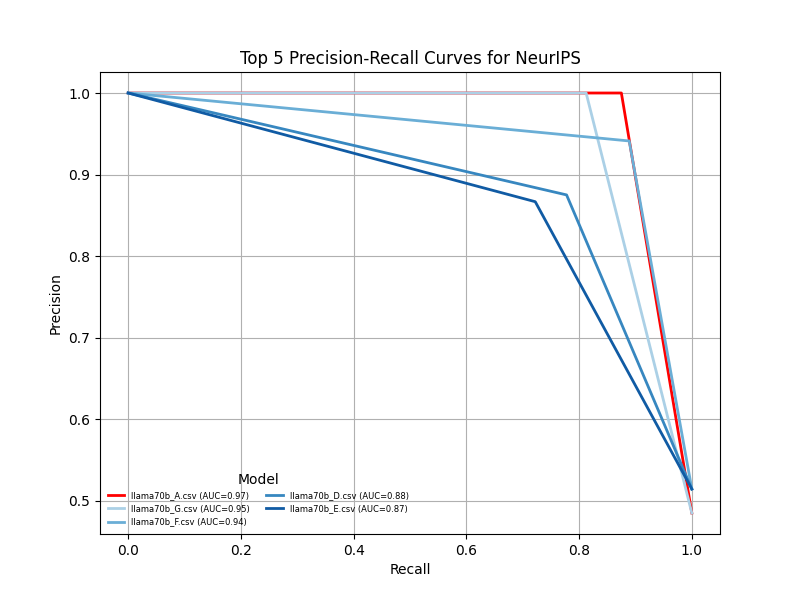
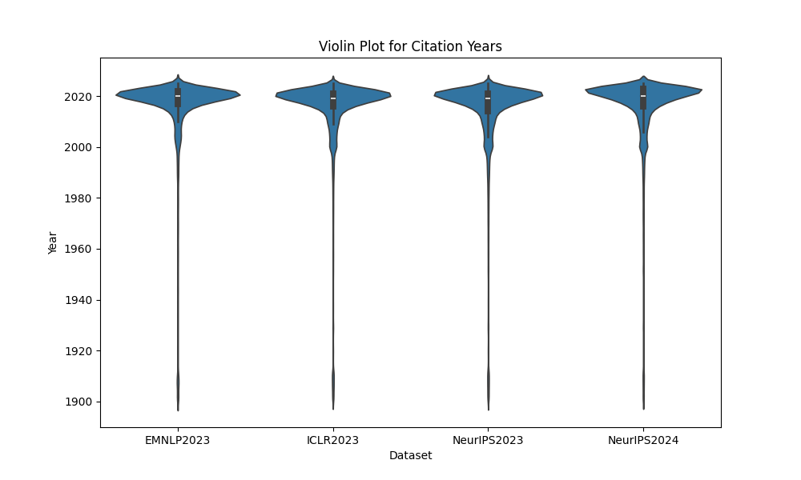
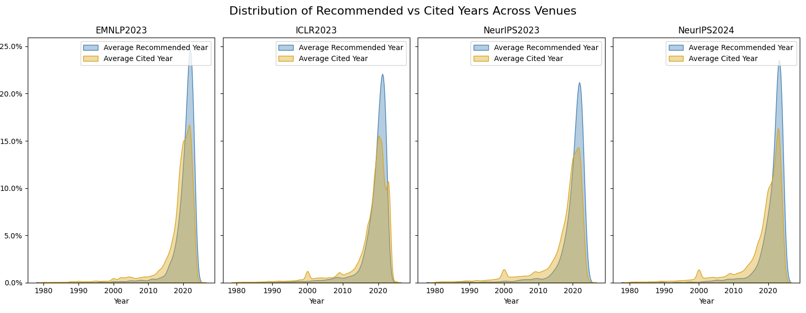
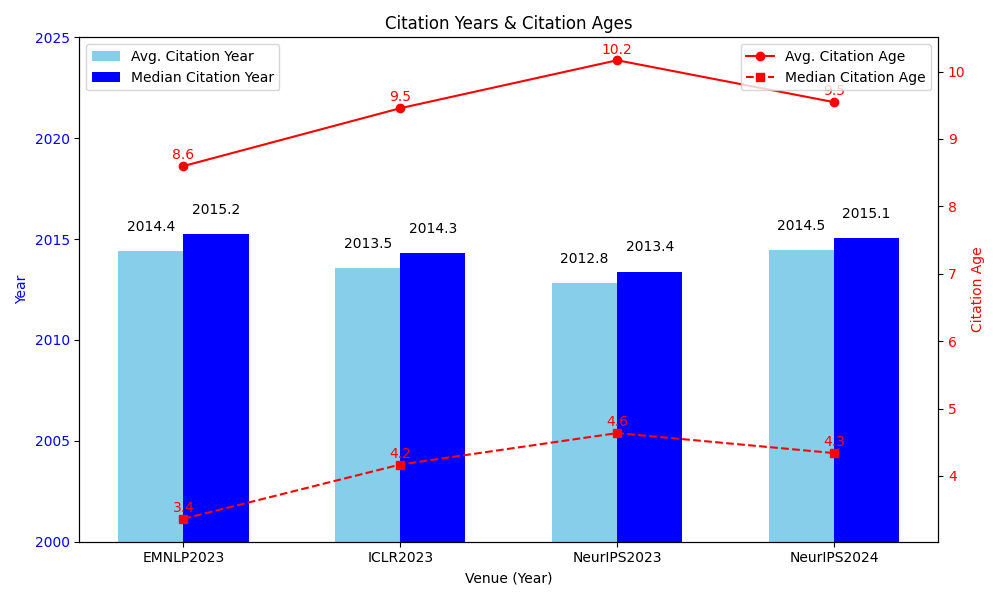
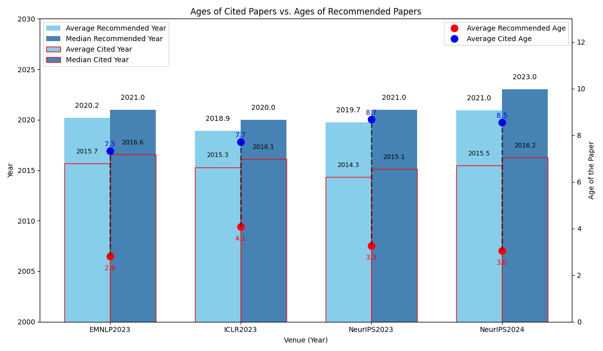

# Quantifying Biases in Peer Review: Analyzing Reviewer Suggestions in Artificial Intelligence Publications

This project provides a framework for analyzing biases induced by citation suggestions from peer review at major AI conferences. It includes tools for retrieving, converting, annotating, and shuffling review data, as well as sending prompts together with review data to open-source large language models via API to evaluate their performance in suggesting additional citations based on the reviews. The project also analyses different aspects of biases in peer review suggestions. 

**Prerequisites**
- Python 3.x
- LM Studio for interacting with language models
- OpenReview API keys for data retrieval


## Data Retrieval

### Python scripts for Data Retrieval via OpenReview API

For different Research Questions (RQ), different review data are fetched. The following is a list of different data and the scirpts that were used to accquire them:
- Reviews from all the reviewers for each paper. 
- Decision with meta review for all the papers. 
- All the rebuttals for each paper. 
- Submission data (data about the submitted paper, e.g., abstract, key word, primary topcis, etc.)
- Attachments (PDF) for all the submitted papers.

OpenReview has different API versions, API v2.0 and v1.0. The following are examples of how to fetch data with different API versions. 
Make sure to install dependencies first:
```bash
pip install openreview-py
```

For API v1.0 (all the ICLR venues in this project), use the following:

```python
### Example usage for getting all the reviews using API v1.0 ###
import openreview

client = openreview.Client(baseurl='https://api.openreview.net')
submissions = client.get_all_notes(
    invitation="ICLR.cc/2019/Conference/-/Blind_Submission",
    details='directReplies'
)
```

For API v2.0 (all the EMNLP and NeurIPS venues in this project), use the following:
```python
### Example usage for getting all the reviews using API v2.0 ###
import openreview
client = openreview.api.OpenReviewClient(
    baseurl='https://api2.openreview.net',
    username="<your OpenReview account>",
    password="<your password>"
)

venue_group = client.get_group('NeurIPS.cc/2024/Conference')
submission_name = venue_group.content['submission_name']['value']
submissions = client.get_all_notes(invitation=f'NeurIPS.cc/2024/Conference/-/{submission_name}')
review_name = venue_group.content['review_name']['value']
reviews=[openreview.api.Note.from_json(reply) for s in submissions for reply in s.details['replies'] if f'{venue_id}/{submission_name}{s.number}/-/{review_name}' in reply['invitations']]
```

- The retrieved reviews are defaultly saved in JSON format under `raw_data` with the naming format of `<venue+year>_reviews.json`, e.g., `EMNLP2023_reviews.json`

- The retrieved decisions and metareviews are saved in JSON format under `raw_data` with the naming format of `<venue+year>_decisions.json`, e.g., `EMNLP2023_decisions.json`

- The retrieved rebuttals are saved in JSON format under `raw_data` with the naming format of `<venue+year>_rebuttals.json`, e.g., `EMNLP2023_rebuttals.json`

- The retrieved submission data are saved in JSON format under `raw_data` with the naming format of `<venue+year>_submissions.json`, e.g., `EMNLP2023_submissions.json`

- The retrieved PDFs are saved in Google Drive whose link is provided in a text file: `raw_data/all_venues_papers.txt`


*Note: For different type of data other than reviews, e.g., PDFs of all the submissions, please refer to the official documentation of OpenReview API (see https://docs.openreview.net/how-to-guides/data-retrieval-and-modification).*

*Note: data accquired by different scripts sometimes have overlaps. However, they can always be merged when needed according to the review ID or the paper ID (details will be introduced in the Workflow section).*


## Workflow

### Question 1: Analysing Review Texts

#### 1. JSON to CSV Conversion
Python scripts are provided to convert the JSON files into CSV format for easier processing for later manual annotation:
- `scripts/convert_json_csv_API2_reviews.py`: Converts **EMNLP** and **NeurIPS** JSON data to CSV.
- `scripts/convert_json_csv_API1_reviews.py`: Converts **ICLR** JSON data to CSV.

Converted CSV files:
- `raw_data/EMNLP2023.csv`
- `raw_data/NeurIPS2023.csv`
- `raw_data/NeurIPS2024.csv`
- `raw_data/ICLR2023.csv`

#### 2. Manual Annotation
After converting the JSON files to CSV:
- 50 reviews where reviewers suggest authors cite additional literature are manually marked as **positive cases** (`1`).
- 50 reviews without such suggestions are manually marked as **negative cases** (`0`).
- These 100 labeled cases are evenly distributed across the three venues: **EMNLP**, **NeurIPS**, and **ICLR**, with each of them roughly having 33.3% of the annotated data.
- Labeled files are saved as:
   - `processed_data/annotated_data_for_reviews/EMNLPwithLabels.csv`
   - `processed_data/annotated_data_for_reviews/NeurIPSwithLabels.csv`
   - `processed_data/annotated_data_for_reviews/ICLRwithLabels.csv`

#### 3. Shuffle Labeled Data
The labeled data is shuffled to ensure random distribution:
- **Issue**: Positive cases were originally at the beginning, and negative cases were at the end.
- **Solution**: `shuffle_csv.py` shuffles the labeled data files.
- Resulting files:
  - `processed_data/annotated_data_for_reviews/shuffled_ICLRwithoutLabels.csv`
  - `processed_data/annotated_data_for_reviews/shuffled_EMNLPwithoutLabels.csv`
  - `processed_data/annotated_data_for_reviews/shuffled_NeurIPSwithoutLabels.csv`

#### 4. Language Model Response Collection
The shuffled data is used to evaluate language model performance in identifying citation suggestions:
- `scripts/get_lm_response.py` sends each review plus a **prompt** to a **llama8b** via **LM Studio** API.
- `scripts/get_response_csv_70b.py`sends each review plus a **prompt** to **llama70b** via **LM Studio** API running on server from **GippLab**.
- All the prompts can be found in `processed_data/prompts_for_models.txt`
- The model's response is saved in a new column, `response`, in the output CSV files.
- Responses from different models/prompts are saved in different csv with the naming pattern of `venue_model_promptX.csv`.
- All the files can be found at `processed_data/annotated_data_for_reviews` 

#### 5. Language Model Response Comparison 
The responses returned by the models are evaluated against golden data annotated at **Step 2 Manual Annotation**:
- `scripts/compare_prompts.py` calculates and compares acc., recall, precision, f1 scores of all the responses returned by different models/prompts.



#### 6. Get Responses Using the Best Models and Prompts
- `scripts/get_response_csv_70b.py` is used to get all the responses from the best models and prompts.
- CSVs with all the responses from best models and prompts are saved under `processed_data/processed_data_for_citations_in_review`.


### Question 2: Analysing Citation and Suggested Years

#### 1. Extract Citation Years 
Python scripts are provided to extract all the years from all the submission PDFs:
- `scripts/extract_citation_years.py`uses regular expression to extract all the citatoin years under various patterns.
- CSVs with all the citatoin year data are saved under `processed_data/processed_data_for_citations_in_paper`.

#### 2. Extract Suggested Years 
Python scripts are provided to extract all the years from all the submission PDFs:
- `scripts/extract_suggested_years.py`uses regular expression to extract all the suggested years under various patterns.
- CSVs with all the citatoin year data are saved under `processed_data/processed_data_for_citations_in_review`.

#### 3. Analyse and Visualize
The years extracted in last step are analyzed and visualized through the following scripts:
- `scripts/violin_plot.py` visualize the distribution of all the citation years across the venues.

- `scripts/violin_plot_combined.py` visualize the distribution of all the citation years and suggested years across the venues.

- `scripts/citation_age.py` calculates average ages of paper being cited in different venues and visualize the averages and medians.

- `scripts/citation_age_combined.py` calculates average ages of paper being cited and suggested in different venues and visualize the averages and medians.



### Question 3: Analysing Topics Distribution in Suggested Papers

#### 1. Extract Suggested Papers


### Question 4:  What are the most common keywords and phrases used in a reject case as opposed to an accept case? What are the most common reasons for acceptance and rejection?
#### 1. Fetch paper decision JSON
- Paper decisions in JSON format are acquired via OpenReview API. The raw data is saved under `raw_data`

#### 2. Combine paper decision and review data
- Scripts for merging review JSON and decision JSON are: `scripts/merge_review_decision_api1` (for processing ICLR) and `scripts/merge_review_decision_api2` 
- Scirpts for top n-gram comparison 
