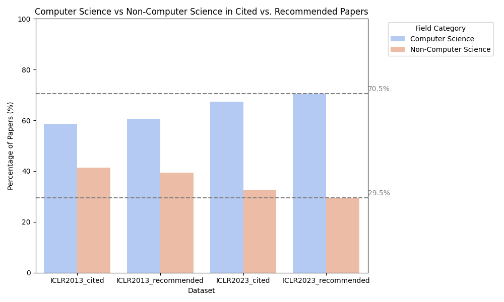

# Quantifying Biases in Peer Review: Analyzing Reviewer Suggestions in Artificial Intelligence Publications

This project provides a framework for analyzing biases induced by citation suggestions from peer review at major AI conferences. It includes tools for retrieving, converting, annotating, and shuffling review data, as well as sending prompts together with review data to open-source large language models via API to evaluate their performance in suggesting additional citations based on the reviews. The project also analyses different aspects of biases in peer review suggestions. 

**Prerequisites**
- Python 3.x
- LM Studio for interacting with language models
- OpenReview API keys for data retrieval


## Data Retrieval

### Python scripts for Data Retrieval via OpenReview API

OpenReview has different API versions, API v2.0 and v1.0. The following are examples of how to fetch data with different API versions. 
Make sure to install dependencies first:
```bash
pip install openreview-py
```

For API v1.0 (all the ICLR venues in this project), use the following:

```python
### Example usage for getting all the reviews using API v1.0 ###
import openreview

client = openreview.Client(baseurl='https://api.openreview.net')
submissions = client.get_all_notes(
    invitation="ICLR.cc/2019/Conference/-/Blind_Submission",
    details='directReplies'
)
```

For API v2.0 (all the EMNLP and NeurIPS venues in this project), use the following:
```python
### Example usage for getting all the reviews using API v2.0 ###
import openreview
client = openreview.api.OpenReviewClient(
    baseurl='https://api2.openreview.net',
    username="<your OpenReview account>",
    password="<your password>"
)

venue_group = client.get_group('NeurIPS.cc/2024/Conference')
submission_name = venue_group.content['submission_name']['value']
submissions = client.get_all_notes(invitation=f'NeurIPS.cc/2024/Conference/-/{submission_name}')
review_name = venue_group.content['review_name']['value']
reviews=[openreview.api.Note.from_json(reply) for s in submissions for reply in s.details['replies'] if f'{venue_id}/{submission_name}{s.number}/-/{review_name}' in reply['invitations']]
```

For different Research Questions (RQ), different review data are fetched. 

- The retrieved reviews are defaultly saved in JSON format under `raw_data` with the naming format of `<venue+year>_reviews.json`, e.g., `EMNLP2023_reviews.json`

- The retrieved decisions and metareviews are saved in JSON format under `raw_data` with the naming format of `<venue+year>_decisions.json`, e.g., `EMNLP2023_decisions.json`.

- The retrieved rebuttals are saved in JSON format under `raw_data` with the naming format of `<venue+year>_rebuttals.json`, e.g., `EMNLP2023_rebuttals.json`. All the rebuttal data are compressed under `all_rebuttals.zip` due to git size limit. 

- The retrieved submission data are saved in JSON format under `raw_data` with the naming format of `<venue+year>_submissions.json`, e.g., `EMNLP2023_submissions.json`.  All the ICLR submission data are compressed under `ICLR_submissions.zip` due to git size limit. 

- The retrieved PDFs are saved in Google Drive whose link is provided in a text file: `raw_data/all_venues_papers.txt`


*Note: For different type of data other than reviews, e.g., PDFs of all the submissions, please refer to the official documentation of OpenReview API (see https://docs.openreview.net/how-to-guides/data-retrieval-and-modification).*

*Note: data accquired by different scripts sometimes have overlaps. However, they can always be merged when needed according to the review ID or the paper ID (details will be introduced in the Workflow section).*


## Workflow

### 0: General Pre-processing
Python scripts are provided to convert the JSON files into CSV format for easier processing for later manual annotation:
- `scripts/Preprocessing/convert_json_csv_API2_reviews.py`: Converts **EMNLP** and **NeurIPS** JSON data to CSV.
- `scripts/Preprocessing/convert_json_csv_API1_reviews.py`: Converts **ICLR** JSON data to CSV.
For other data like submission data, only minor adjustments, i.e., changing column names, need be to done. All the converted CSVs are also saved under `raw_data`.

### RQ A1: Analysing Review Texts

#### 1. Manual Annotation
After converting the JSON files to CSV:
- 50 reviews where reviewers suggest authors cite additional literature are manually marked as **positive cases** (`1`).
- 50 reviews without such suggestions are manually marked as **negative cases** (`0`).
- These 100 labeled cases are evenly distributed across the three venues: **EMNLP**, **NeurIPS**, and **ICLR**, with each of them roughly having 33.3% of the annotated data.
- Labeled files are saved as:
   - `processed_data/annotated_data_for_reviews/EMNLPwithLabels.csv`
   - `processed_data/annotated_data_for_reviews/NeurIPSwithLabels.csv`
   - `processed_data/annotated_data_for_reviews/ICLRwithLabels.csv`

#### 2. Shuffle Labeled Data
The labeled data is shuffled to ensure random distribution:
- **Issue**: Positive cases were originally at the beginning, and negative cases were at the end.
- **Solution**: `shuffle_csv.py` shuffles the labeled data files.
- Resulting files:
  - `processed_data/annotated_data_for_reviews/shuffled_ICLRwithoutLabels.csv`
  - `processed_data/annotated_data_for_reviews/shuffled_EMNLPwithoutLabels.csv`
  - `processed_data/annotated_data_for_reviews/shuffled_NeurIPSwithoutLabels.csv`

#### 3. Language Model Response Collection
The shuffled data is used to evaluate language model performance in identifying citation suggestions:
- `scripts/RQ_A/get_lm_response.py` sends each review plus a **prompt** to a **llama8b** via **LM Studio** API.
- `scripts/RQ_A/get_response_csv_70b.py`sends each review plus a **prompt** to **llama70b** via **LM Studio** API running on server from **GippLab**.
- All the prompts can be found in `processed_data/prompts_for_models.txt`
- The model's response is saved in a new column, `response`, in the output CSV files.
- Responses from different models/prompts are saved in different csv with the naming pattern of `venue_model_promptX.csv`.
- All the files can be found at `processed_data/annotated_data_for_reviews` 

#### 4. Language Model Response Comparison 
The responses returned by the models are evaluated against golden data annotated at **Step 1 Manual Annotation**:
- `scripts/RQ_A/assign_tags.py` gives binary tags for reviews based on the model response -- containing "yes" for `1` else `0`.
- `scripts/RQ_A/compare_prompts.py` calculates and compares acc., recall, precision, f1 scores of all the responses returned by different models/prompts.
- For comparison, there's also a notebook containing results of regex-based method of determining citation recommendations under `scripts/RQ_A/regex_baseline.ipynb`


#### 5. Get Responses Using the Best Models and Prompts
- `scripts/RQ_A/get_response_csv_70b.py` is used to get all the responses from the best models and prompts.
- CSVs with all the responses from best models and prompts are saved under `processed_data/processed_data_for_citations_in_review`.


### RQ A2: How does the age of the recommended references compare to the distribution of ages of references that the paper had cited?

#### 1. Extract Citation Years 
Python scripts are provided to extract all the years from all the submission PDFs:
- `scripts/RQ_A/extract_citation_years.py`uses regular expression to extract all the citatoin years under various patterns.
- CSVs with all the citatoin year data are saved under `processed_data/processed_data_for_citations_in_paper`.

#### 2. Extract Suggested Years 
Python scripts are provided to extract all the years from all the submission PDFs:
- `scripts/RQ_A/extract_suggested_years.py`uses regular expression to extract all the suggested years under various patterns.
- CSVs with all the citatoin year data are saved under `processed_data/processed_data_for_citations_in_review`.

#### 3. Analyse and Visualize
The years extracted in last step are analyzed and visualized through the following scripts:
- `scripts/RQ_A/violin_plot.py` visualize the distribution of all the citation years across the venues.

- `scripts/RQ_A/violin_plot_combined.py` visualize the distribution of all the citation years and suggested years across the venues.

- `scripts/RQ_A/citation_age_combined.py` calculates average ages of paper being cited and suggested in different venues and visualize the averages and medians.


### RQ A3: a. How often do the recommended references fall into the field of ML/AI as opposed to fall in other fields? How many recommendations are outside of CS? b. Is the distribution of fields of study different from that of papers cited in the submissions?

#### 1. Extract Recommended and Cited Papers

- `scripts/RQ_A/get_recommended_titles.py` utilizes an LLM-aided method to extract recommended paper titles from review responses. Additionally, LLM output is manually corrected and annotated for higher accuracy.
- `scripts/RQ_A/get_cited_titles.py` processses PDFs of submitted papers and extract the lists of cited papers.

#### 2. Field of Study Analysis

- `scripts/RQ_A/s2.py` sends paper titles and metadata to the Semantic Scholar API to retrieve corresponding S2 paper IDs. These IDs are then used to fetch the Field of Study classification for each paper (e.g., ML/AI, other CS fields, or non-CS).

#### 3. Visualization

- use `scripts/RQ_A/field_of_study.py` to visualize the distribution of recommended or cited papers.




### RQ B1: What are the most common keywords and phrases used in a reject case as opposed to an accept case? What are the most common reasons for acceptance and rejection?
#### 1. Categorize Accept and Reject Cases
- 

#### 2. Preprocessing
- 

#### 3. Key Word Analysis
- 


### RQ B2: In which topic areas are the papers recommended by peer review? Is there a bias toward recommending specific topics?
#### 1. Categorize Accept and Reject Cases
- 

#### 2. Preprocessing
- 

#### 3. Key Word Analysis
- 

### RQ B3: Does the paper decision correlates with citation recommendation, i.e., does rejected papers get more citation recommendations comparing to accepted papers?
#### 1. Categorize Accept and Reject Cases
- Only ICLR2023 is analysed for this RQ, as it is the only one that has enough rejected data.
- Merge all the accept cases, e.g., accept (main), accept (poster), into one category. 


#### 2. Preprocessing
- Run the following code on the csv which contains the number of reviewers recommending extra literature to convert them into binary categories, i.e., whether there's recommended literature to a paper. 

```python
import pandas as pd
df = pd.read_csv('merged_ICLR2023_llama70b.csv') 
df['number of reviewers recommending'] = df['response'].apply(lambda x: 1 if 'Yes,' in str(x) else 0)
df.to_csv('ICLR2023_llama70b_with_rec_num_binary.csv', index=False)
```
- `decision_recommendation_corelate.py` analyse the corelation between whether the paper got recommended extra literature / the number of reviewers recommending extra literature, and the final decision. The script includes visualization, t-test and chi-square test. 

#### 3. Visualization and Results
- There is a statistical significance between paper decision and getting extra literature recommendation
| Data                                                       | Chi-square statistic | P-value  |
|------------------------------------------------------------|----------------------|----------|
| Whether or not Reviewers Recommending Extra Literature     | 5.9710               | 0.0145   |
| Number of Reviewers Recommending Extra Literature          | 35.6557              | < 0.0001 |


### RQ C1: a. How often do authors agree to incorporate the citing suggestions from the reviewers? b. How often do authors incorporate the citing suggestions from the reviewers?
#### 1. Preprocessing
- 

#### 2. Preprocessing
- 

#### 3. Key Word Analysis
- 

### RQ C2:Do papers that heavily cite recent work receive better peer review outcomes/ higher review scores (i.e., final reject/accept or individual reviewer scores from 1-5 or 1-10) than those with a more balanced or diverse citation age?
#### 1. Preprocessing
- 

#### 2. Preprocessing
- 

#### 3. Key Word Analysis
- 


## Datasets for Future Work